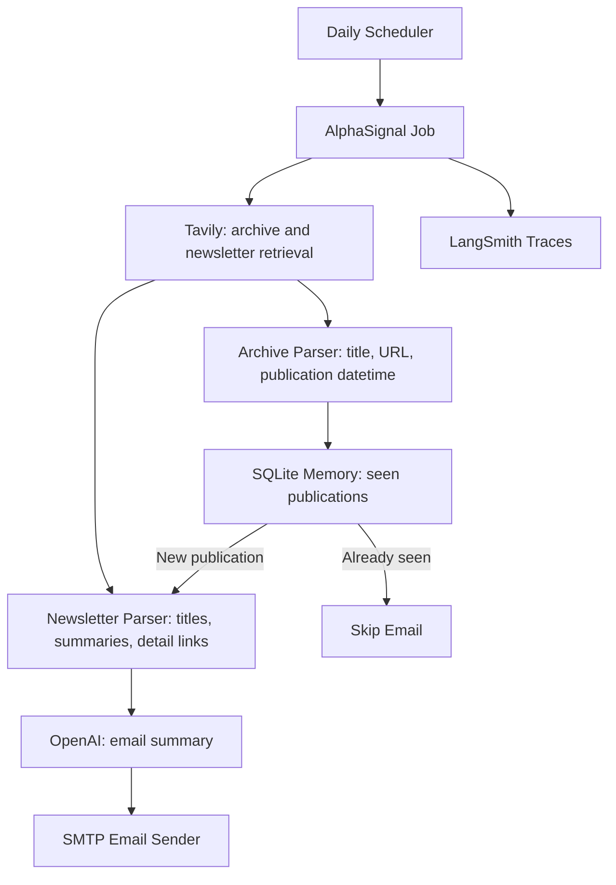

# AlphaSignal News Agent Plan

## Scope

Create a greenfield implementation in the empty repo under a backend-worker layout. The first version will use generic SMTP for email delivery and a long-running Docker container with an internal daily scheduler.

## Architecture

## Implementation Steps

1. Scaffold the project

- Add `[backend/app/core/config.py](backend/app/core/config.py)` for `.env` settings via `pydantic-settings`.
- Add `[backend/app/main.py](backend/app/main.py)` with a minimal health endpoint for container probes.
- Add `[backend/app/jobs/scheduler.py](backend/app/jobs/scheduler.py)` for the internal APScheduler loop.
- Add `[backend/app/jobs/run_daily_alphasignal.py](backend/app/jobs/run_daily_alphasignal.py)` as the scheduled job entrypoint.

1. Add AlphaSignal services

- Add `[backend/app/services/alphasignal/tavily_client.py](backend/app/services/alphasignal/tavily_client.py)` to query/fetch AlphaSignal archive and newsletter content with Tavily.
- Add `[backend/app/services/alphasignal/archive_parser.py](backend/app/services/alphasignal/archive_parser.py)` to extract archive entries from rows like `🤖 The solo bot ceiling: why enterprises need a team agent 5/29/2026, 7:59:48 PM`, capturing title, URL, and publication datetime.
- Add `[backend/app/services/alphasignal/newsletter_parser.py](backend/app/services/alphasignal/newsletter_parser.py)` to enter only unseen newsletter pages and normalize the latest newsletter into structured items: highlight titles, detailed news titles, summaries/resumes, and detail links below each item.
- Add `[backend/app/services/alphasignal/summarizer.py](backend/app/services/alphasignal/summarizer.py)` to call an OpenAI model and produce the final email digest.
- Add `[backend/app/services/alphasignal/email_sender.py](backend/app/services/alphasignal/email_sender.py)` for SMTP email delivery.
- Add `[backend/app/services/alphasignal/memory.py](backend/app/services/alphasignal/memory.py)` backed by SQLite so archive entries already processed by publication URL/date/title are skipped before fetching newsletter details.

1. Add shared models and observability

- Add `[shared/schemas/alphasignal.py](shared/schemas/alphasignal.py)` with Pydantic models for archive entries, newsletters, and news items.
- Add LangSmith tracing around archive lookup, newsletter extraction, memory decision, summarization, and email send.
- Record enough metadata to trace what happened without logging secrets.

1. Add Docker and runtime config

- Add `[backend/requirements.txt](backend/requirements.txt)` with FastAPI, APScheduler, Tavily, OpenAI/LangChain/LangSmith, SQLAlchemy, dotenv/config, and test dependencies.
- Add `[Dockerfile](Dockerfile)` for a Python slim image that starts the internal scheduler.
- Add `[docker-compose.yml](docker-compose.yml)` with `.env` loading and a mounted `./data:/data` volume for SQLite memory.
- Add `[.dockerignore](.dockerignore)` and `[.env.example](.env.example)` documenting required secrets and runtime options.

1. Add focused tests

- Add `[tests/backend/test_alphasignal_memory.py](tests/backend/test_alphasignal_memory.py)` for dedup behavior.
- Add parser tests with fixture-like sample newsletter content if the implementation needs deterministic extraction coverage.
- Mock Tavily, OpenAI, LangSmith, and SMTP in tests.

1. Update documentation

- Create/update `[README.md](README.md)` with setup, env vars, Docker usage, scheduling behavior, endpoints, dependencies, and deployment notes.
- Create/update `[DEVELOPMENT.md](DEVELOPMENT.md)` with the required implementation entry, files modified, rationale, breaking changes, and next steps.

## Key Defaults

- Email delivery: generic SMTP from env vars.
- Schedule: internal APScheduler daily run, configurable by `RUN_HOUR_UTC` and `RUN_MINUTE_UTC`.
- Memory: SQLite at `sqlite:////data/ai_watch.db` in Docker, mounted as a persistent volume.
- New publication detection: use the archive row publication datetime plus URL/title as the canonical dedup key, then fetch and parse the newsletter only when that archive entry is unseen.
- OpenAI model: configurable with `OPENAI_MODEL`, defaulting to a small modern model suitable for summaries.
- Tavily is the primary web retrieval path because simple static fetches may only return the AlphaSignal archive shell.

## Validation

- Run unit tests for memory, archive parsing, and newsletter parsing behavior.
- Run import or smoke checks for the scheduler/job module.
- Check lints/diagnostics on edited files.
- Do not bake secrets into the Docker image; rely on `.env` or deployment secret injection.

